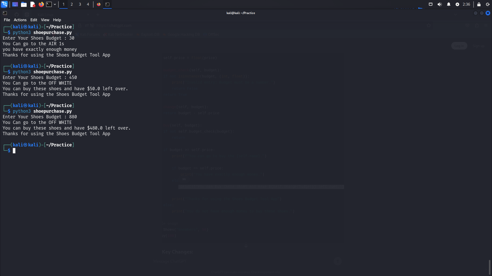

# Shoes Budget Tool

The Shoes Budget Tool is a Python application designed to help users manage their budget when buying shoes. It checks if you have enough money for a purchase and calculates how much money you'll have left over.

Features:
- Validates if the budget is a valid number (integer or float).
- Calculates the remaining budget after buying a pair of shoes.
- Provides feedback on whether the user has enough money and displays the remaining amount.

To use the Shoes Budget Tool, clone the repository and run the script using Python 3:

```bash
git clone <repository-url>
cd <repository-directory>
python3 shoepurchase.py
```

Usage:
1. **Create a `Shoes` Object**: Initialize with the name and price of the shoes.
2. **Call the `buy` Method**: Pass your budget to check if you can afford the shoes and calculate the remaining amount.

Example:

```python
from shoes_budget_tool import Shoes

# Initialize the Shoes object with name and price
shoes = Shoes("Sneakers", 50)

# Check if you can buy the shoes with a given budget
shoes.buy(100)
```
## Screenshot




This project is licensed under the MIT License. See the [LICENSE](LICENSE) file for details.
```

Replace `<repository-url>` and `<repository-directory>` with the appropriate values for your project.
